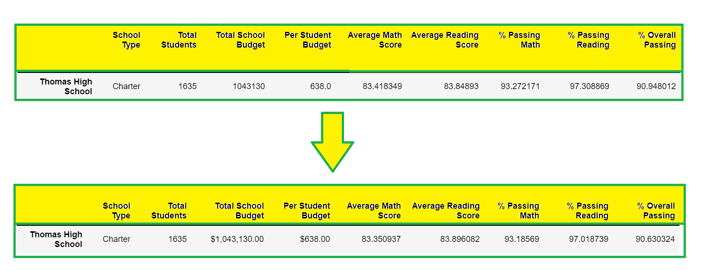

# School_District_Analysis (Pandas project)

## Overview of the project 

In this project, we were working on a School district data-set using jupyter notebook and pandas. Pandas is a python
library for data manipulation and analysis. Pandas is being used in this project along with the jupyter notebook to
read raw data in a csv file, clean and inspect the data, merge data-sets, perform calculations and create tables.

### Purpose 

The main purpose of the project was to re-analyse the school district data-set after certain discrepancies were found in the 9th grade students' data-set for Thomas High School. The analysis was required to be done regarding the school funding and standardized student test scores in order to make informed decisions related to school budgeting and prioritization.

## Results

- **Effect on district summary:**
  
  By looking at the below image, we can see that the average math and reading scores have decreased.
  This has resulted in all the percentage numbers to decrease:

  

- **Effect on school summary:**

  By looking at the below image, we can see that average math and reading scores of **Thomas High School** have decreased
  whereas, the average scores for all other schools did not change. This has resulted in all the percentage numbers to decrease:

  

 - **Effect on Thomas High School’s performance relative to the other schools after replacing the ninth graders’ math and reading     scores:**

   
    By looking at the below image, we can see that the Thomas High School's overall passing percentage has slightly decreased after replacing the ninth graders' math and reading scores but it has not affected the Thomas High Schools' ranking in comparison with other schools:

    

    By looking at the below image, we can see that the math and reading scores for 9th graders of Thomas High School have changed
    to `NaN` whereas, the scores have not changed for any other school or grade as compared to older summary:

    

    By looking at the below image, we can see that there are changes observed only in the **$631-645** bin row in the summary.
    The changes are outlined below:
    - Average Math Scores and correspondingly `% Passing Math` have slightly decreased.
    - Average Reading Scores and correspondingly `% Passing Reading` have slightly increased.
    - `% Overall Passing` has also slightly decreased.

    

    By looking at the below image, we can see that there are changes observed only in the **Medium** school size category row in
    the summary. The changes are outlined below:
    - Average Math Scores and correspondingly `% Passing Math` have slightly decreased.
    - Average Reading Scores and correspondingly `% Passing Reading` have slightly increased.
    - `% Overall Passing` has also slightly decreased.

    

    By looking at the below image, we can see that there are changes observed only in the **Charter** category school type row in
    the summary. The changes are outlined below:
    - Average Math Scores and correspondingly `% Passing Math` have slightly decreased.
    - Average Reading Scores and correspondingly `% Passing Reading` have slightly increased.
    - `% Overall Passing` has also slightly decreased.